# Message App

Android messaging application built with Kotlin and Jetpack Compose, with real-time updates, notifications, media sharing, and a responsive UI.

  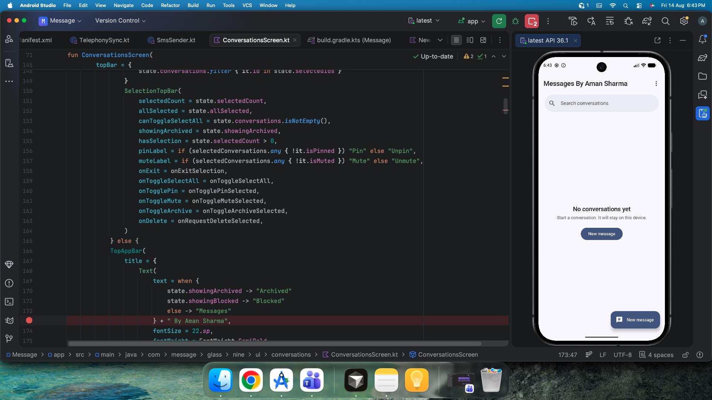

## About

Message App is a client project I developed using Kotlin and Jetpack Compose.

The app is built around everyday messaging workflows, with a focus on fast interactions, real-time updates, and a clean interface that adapts to different Android screen sizes.

## Features

- Real-time conversation and message updates
- Real-time notifications
- Send messages to individual recipients
- Send messages to multiple recipients
- Send media and attachments
- SMS and MMS support
- Conversation search
- Contact selection
- Recent recipients
- Message conversation screen
- Message delivery status
- Pin conversations
- Archive conversations
- Mute conversations
- Delete conversations
- Select and manage multiple conversations
- Sync conversations from the device
- Default SMS app support
- Message notification controls
- Light, dark, and system appearance modes
- MMS auto-download
- Wi-Fi-only MMS download option

## Technology

- Kotlin
- Jetpack Compose
- Material Design 3
- Android
- Android SMS/MMS APIs
- Modern Compose UI components
- Real-time data handling
- Responsive Compose layouts

## Responsive UI

The application is designed to adapt to different Android screen sizes and orientations.

The UI uses flexible Jetpack Compose layouts rather than fixed screen dimensions, so screens can adjust their spacing and content according to the available space.

## Screenshots

[Visit the screenshots folder](./screenshots/) to view all screenshots.

<table>
  <tr>
    <td width="33.33%">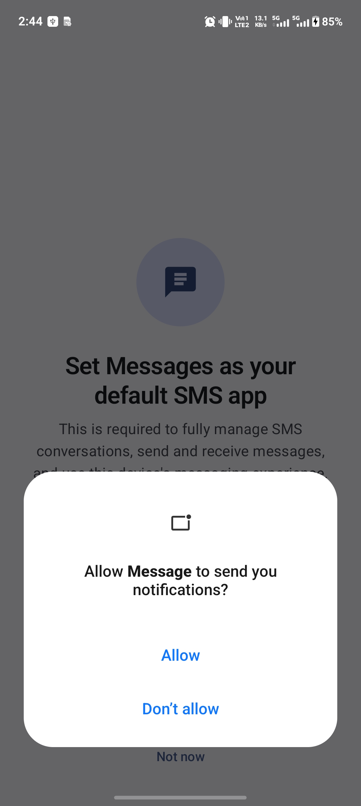</td>
    <td width="33.33%">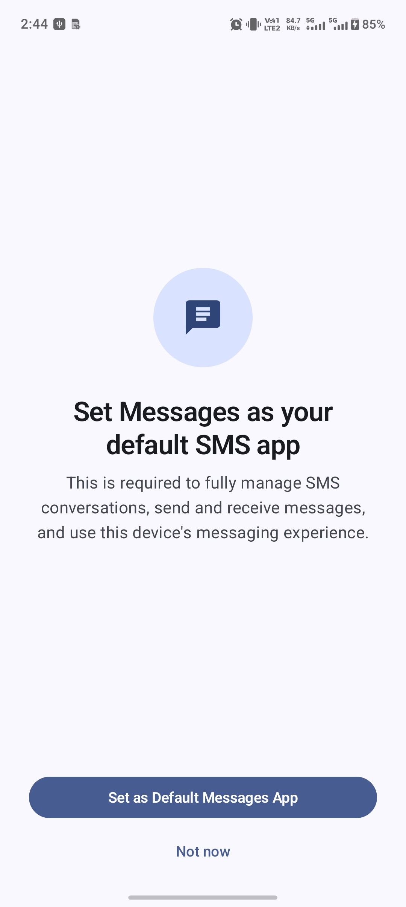</td>
    <td width="33.33%">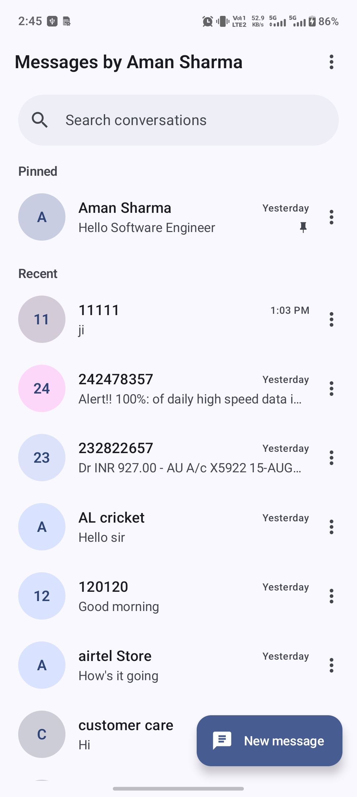</td>
  </tr>
  <tr>
    <td width="33.33%">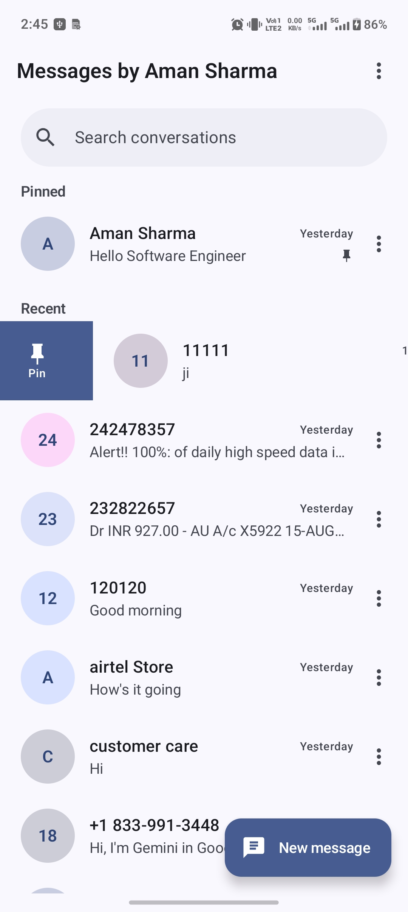</td>
    <td width="33.33%">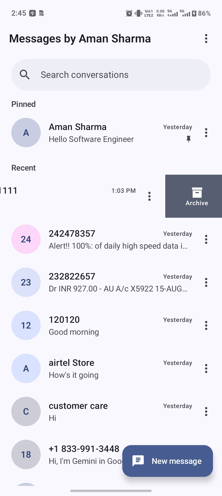</td>
    <td width="33.33%">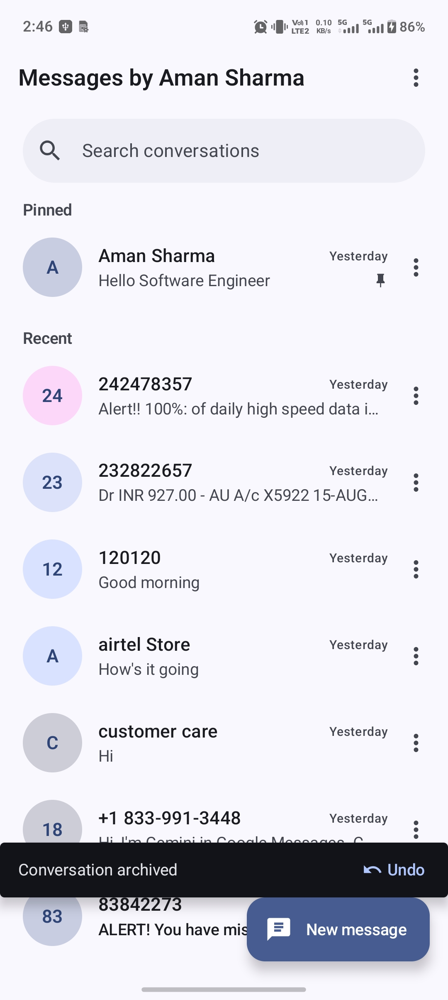</td>
  </tr>
  <tr>
    <td width="33.33%">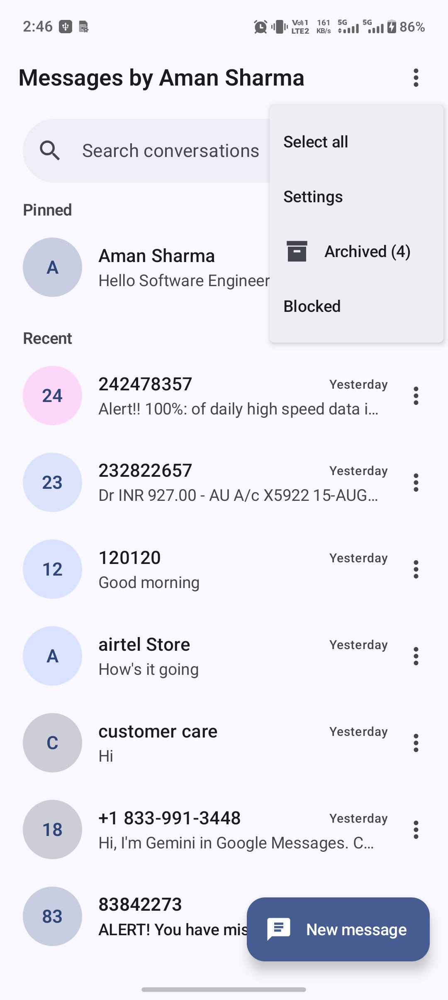</td>
    <td width="33.33%">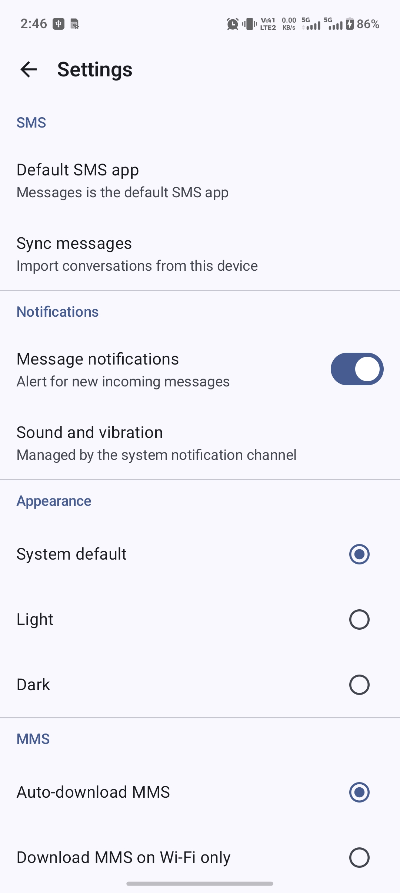</td>
    <td width="33.33%">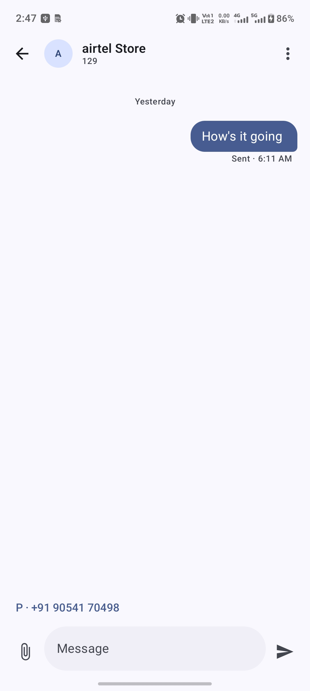</td>
  </tr>
  <tr>
    <td width="33.33%">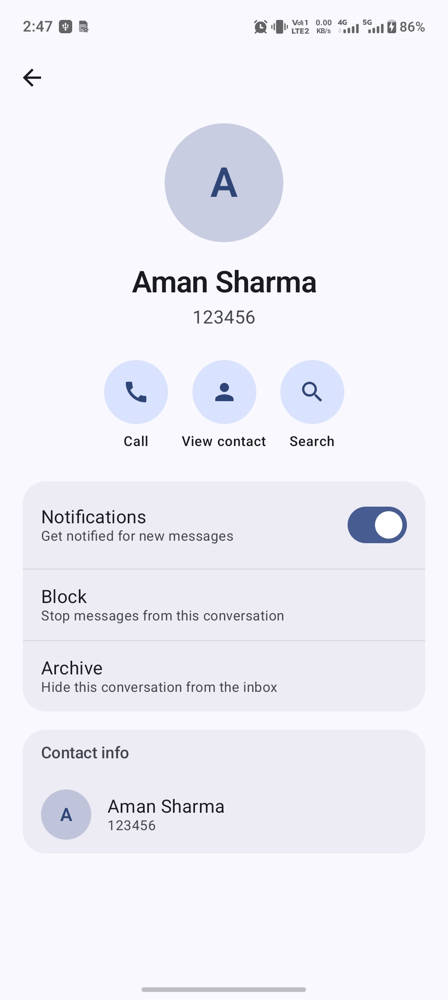</td>
    <td width="33.33%">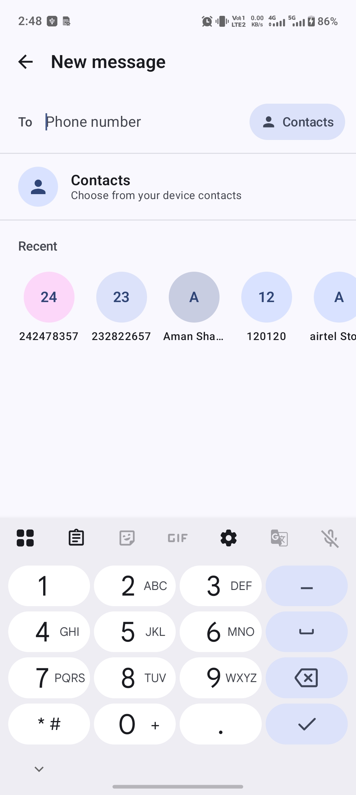</td>
    <td width="33.33%">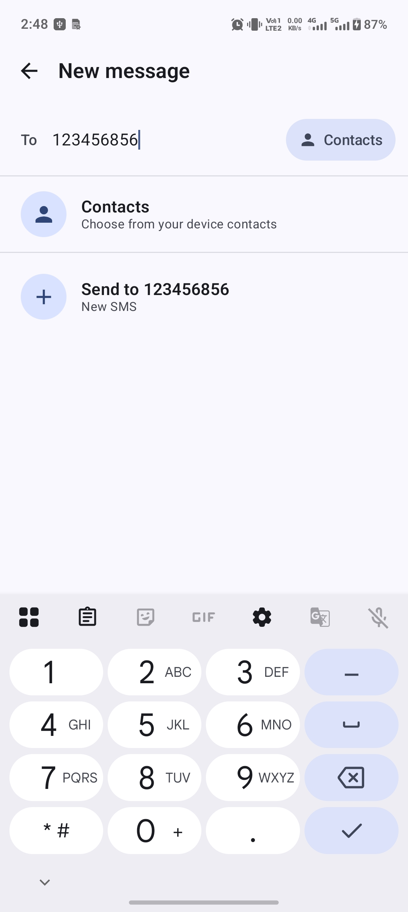</td>
  </tr>
</table>

## Client Project

This application was developed for a client and delivered as a private project.

The screenshots were taken during development before the final delivery. The developer branding shown in these screenshots was removed from the version delivered to the client.

## Project Date

15 August 2026

## Project Details

- Package Name: `com.message.glass.nine`
- Status: Client Project — UI, features, and availability may change in the future.

## Source Code

The source code is not included in this repository because this was a client project and the application was delivered privately.
